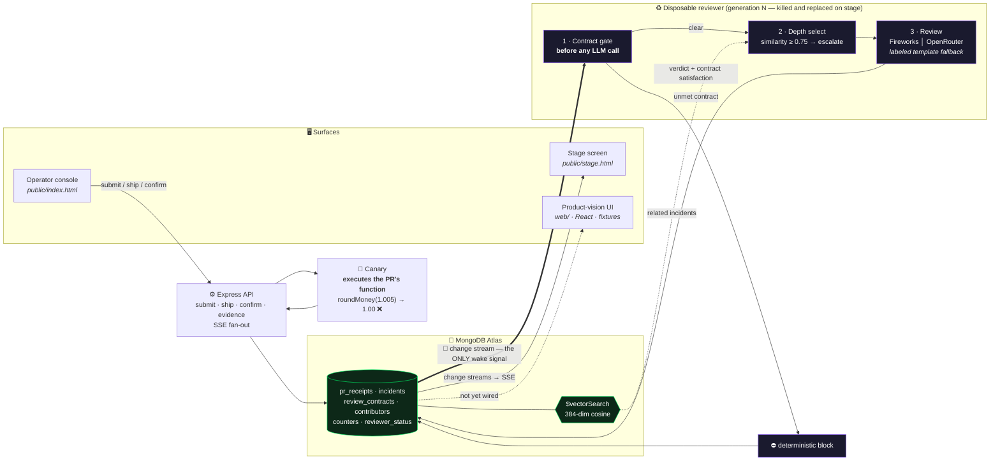
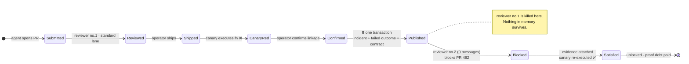

<div align="center">

# 🧾 PR-Elo

### The reviewer dies. The lesson ships.

*An operator-confirmed production failure becomes a durable review contract in MongoDB — and the reviewer's fresh successor enforces it with zero prior messages.*

<br/>

[](https://cerebralvalley.ai/e/persistent-context-sprint-hackathon)

**Powered by**

[](https://www.mongodb.com/atlas)
[](https://fireworks.ai)
[](https://openrouter.ai)

**Stack**

[](https://nodejs.org)
[](https://expressjs.com)
[](https://react.dev)
[](https://typescriptlang.org)
[](https://vite.dev)
[-FFD21E?style=flat-square)](https://huggingface.co/Xenova/all-MiniLM-L6-v2)

</div>

---

## 🎯 What it is

Code-review agents start every session cold. A reviewer approves a bug, the bug ships, the incident happens — and after a restart that same reviewer makes the same mistake, because the lesson lived in a conversation that no longer exists. PR-Elo moves the lesson out of the process and into the database:

```text
PR ships → canary fails in production → operator confirms the causal linkage
        → one transaction publishes a review contract
        → every later PR in that subsystem must carry the missing evidence
```

The reviewer is deliberately disposable. Kill it mid-demo and its successor boots with **zero prior messages**, reads the contract from MongoDB, and blocks a PR that its predecessor would have waved through. That behavioral delta — not a longer prompt — is the whole claim.

**How it frames people.** The Elo is on the *change*, not the author. PR-Elo rates how much proven evidence a pull request must carry to enter a subsystem — a rating that moves when a canary proves something, never a rating of an engineer.

| Rule | What it means |
|---|---|
| 🎯 **The change is what's rated** | Output is a *review-depth requirement* on a PR entering a subsystem. Standing is scoped `contributor × subsystem`, read as history — never published as a global developer score. |
| ❓ **Unknown by default** | States are `unknown · building · proven · proof-debt`. No evidence ≠ trusted, and ≠ suspect. |
| 🏛️ **Organizational, not personal** | A confirmed payments failure guards *every* future payments PR, regardless of author. |
| ↩️ **Recovery is always open** | Proof debt is paid down by executed evidence; contracts unlock. |

---

## 🏗️ Architecture



### Contract lifecycle



---

## 🍃 Why MongoDB is load-bearing

Not a datastore behind the demo — the demo *is* MongoDB behaviors. Every row is verifiable in source.

| MongoDB capability | Load-bearing role | Source |
|---|---|---|
| **Change streams** | The reviewer's **sole** wake signal. No polling loop exists anywhere. Kill the process; the successor resumes from the DB and drains `status: submitted` first. | `receipts/src/reviewer.js:104` |
| **Atlas Vector Search** | `$vectorSearch` over incident embeddings; similarity **≥ 0.75** escalates the PR from standard to deep review. Persistent context changes an *action*, not just a prompt. | `receipts/src/ops.js:37`, `receipts/src/reviewer.js:52` |
| **Transactions** | Incident + failed PR outcome + the future review contract commit atomically in one `session.withTransaction`. A lesson is never half-published. | `receipts/src/ops.js:97` |
| **Deterministic enforcement** | The contract gate runs **before any LLM call**. Reviewer #2 blocking PR #482 is database enforcement, not model judgment. | `receipts/src/reviewer.js:29` |
| **Aggregation + `$lookup`** | Explainable `contributor × subsystem` standing derived from outcomes joined against open proof debt — `unknown` is the default. | `receipts/src/ops.js:143` |
| **Atomic counters** | `nextSeq` keeps PR, incident, and **reviewer generation** identity stable across process restarts. Each restart is a new generation with `msgCount: 0`. | `receipts/src/schema.js:35`, `receipts/src/reviewer.js:85-96` |
| **Programmatic search index** | The 384-dim cosine vector index is created from application code at startup. | `receipts/src/schema.js:58-63` |

Embeddings run **locally** (`Xenova/all-MiniLM-L6-v2`, 384-dim) — no embedding API, so retrieval survives venue wifi. Both LLM lanes fall back to a **visibly labeled** template verdict (`REVIEW_LLM=off`), so a partner API being down can never silently decide the demo.

---

## 🖥️ Two surfaces

| Surface | Path | What it is |
|---|---|---|
| **Canonical demo** | `receipts/public/` | The operator console (numbered controls) and the live stage screen. Backed by real MongoDB writes and driven by change streams over SSE. **This is what runs on stage.** |
| **Product vision** | `receipts/web/` | React 19 + TypeScript strict + Vite 8 + Tailwind v4. Routes: `/` Courtroom (live stream), `/contributor/:id` Dossier, `/review/:id` Case File, with a control-condition compare at `/review/rev-512`. Dark/light, WCAG AA tokens, `prefers-reduced-motion` parity. Design spec: [`receipts/web/DESIGN.md`](receipts/web/DESIGN.md) — *"a microfiche reader in a dark evidence room."* |

**Honest boundary:** the React UI runs on **fixture replay** and is not yet wired to the MongoDB API — it renders the product this becomes, not live data. The mechanics claims in this README are all proven by the `public/` demo and the source referenced above.

---

## 🚀 Run locally

**Prerequisites:** Node.js 20.19+, a MongoDB Atlas deployment with Atlas Vector Search, and a **dedicated demo database** — seed and verify reset PR-Elo collections.

```bash
cd receipts
npm install
cp .env.example .env     # set MONGODB_URI, MONGODB_DB, REVIEW_PROVIDER + its API key
npm run seed             # deterministic demo history
```

Then two long-lived processes in separate terminals:

```bash
npm run server           # http://localhost:4000
```
```bash
npm run reviewer         # generation N — 0 prior messages
```

Open the **operator console** at `http://localhost:4000/` and the **stage** at `http://localhost:4000/stage.html`. Follow the numbered controls; at step 4, `Ctrl-C` the reviewer and run `npm run reviewer` again to create a fresh generation.

<details>
<summary><b>Optional checks & the product-vision UI</b></summary>

```bash
npm test                 # node --test test/*.test.js
npm run llm-smoke        # provider reachability
npm run verify           # ⚠️ DESTRUCTIVE: drops + reseeds all PR-Elo collections
cd web && npm install && npm run dev   # fixture-driven React UI, zero backend needed
```

Set `REVIEW_LLM=off` for fully deterministic template verdicts. Prewarm the local embedding model once while online so it is cached before you rely on offline inference.

</details>

---

## 🛡️ Production readiness

Honest scope. What ships on stage vs. what a real deployment needs:

| Area | Demo scope today | Production needs |
|---|---|---|
| **Canary execution** | `new Function()` — flagged demo-scoped in code; input is authored by the operator at a local console. | A real sandbox (isolate/container) before any untrusted submitter. `receipts/src/ops.js:50` |
| **API surface** | No auth, no input-validation layer on the Express API. | AuthN/Z on every mutating route, schema validation, rate limits. |
| **Reviewer availability** | Single-reviewer singleton heartbeat; change stream has **no resume tokens** (process exits on stream error). | Resume tokens, leader election, backoff + replay from the last token. |
| **Known logic gap** | Contract satisfaction is recorded *before* the verdict is known. | Record satisfaction only on a passing verdict. `receipts/src/reviewer.js:44-48` |
| **Source of truth** | GitHub is simulated through the operator console. | GitHub App + webhooks; PR checks backed by verified CI artifacts. |
| **Evidence** | An evidence key plus optional corrected code, re-executed by the canary. | Independently verified CI test artifacts, signed. |
| **Vector failure mode** | Retrieval errors fall back to "no similar incidents," which can select the standard lane. | Fail **closed** or alert visibly — never silently downgrade scrutiny. |
| **Adjudication** | Any operator can confirm a PR→incident linkage; `/confirm` does not enforce that the PR shipped and its canary failed. | Authenticated incident adjudication with an audit trail and state preconditions. |

Standing explains history — it never grants bypasses or reduces baseline review protection.

---

## 📂 Repository layout

```text
MongoDbhackathon/
├── receipts/                  ← the hackathon demo (canonical)
│   ├── public/
│   │   ├── index.html         ← numbered operator console
│   │   └── stage.html         ← live stage visualization
│   ├── src/                   ← schema · ops · reviewer · embed · llm · server · seed · proof
│   ├── web/                   ← product-vision React UI (fixture replay) + DESIGN.md
│   └── test/                  ← llm.test.js
├── src/ · test/ · examples/   ← standalone TS inference harness (not yet wired to MongoDB — see docs/agent-harness.md)
└── PLAN.md                    ← implementation contract, state transitions, hardening
```

---

## 🏆 Team

**Built by** [@nihalnihalani](https://github.com/nihalnihalani) · [@lachenbach](https://github.com/lachenbach) (Liam Achenbach) · [@gorajing](https://github.com/gorajing) (Jin Choi) — for the [MongoDB Persistent Context Sprint Hackathon](https://cerebralvalley.ai/e/persistent-context-sprint-hackathon), built entirely during the event.

---

<div align="center">

**🧾 PR-Elo — the reviewer dies, the lesson ships.**

</div>
