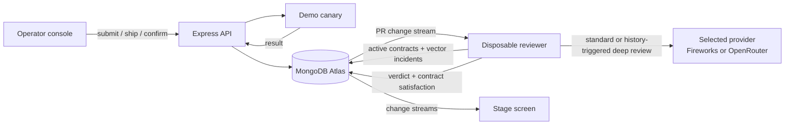

# RECEIPTS

**Persistent review confidence for coding-agent pull requests.**

> The reviewer dies. The lesson ships.

RECEIPTS turns an operator-confirmed production failure into a durable review contract:
the specific evidence every future change in that subsystem must carry. The
reviewer process is disposable; the organization's lessons live in MongoDB and
are enforced by its successor.

Built for the [MongoDB Persistent Context Sprint Hackathon](https://cerebralvalley.ai/e/persistent-context-sprint-hackathon).

## The idea

Code-review agents usually start each session cold. A reviewer can miss a bug,
observe the incident later and still make the same mistake after it restarts.
RECEIPTS closes that loop:

```text
PR ships
  -> production evidence fails
  -> operator confirms the PR-to-incident linkage
  -> MongoDB publishes a review contract
  -> every later PR in that subsystem must provide the missing evidence
```

This is not a global developer score. Contributors in the demo are coding
agents, and their displayed standing is scoped to `contributor x subsystem`:
`unknown`, `building`, `proven` or `proof-debt`. Enforcement is organizational:
a confirmed payments failure creates a payments safeguard for every future
payments PR, regardless of author.

## One-minute demo

1. `agent-kevin` submits PR #481, a payment-rounding change. With no relevant
   history or active contract, reviewer #1 gives it the standard review.
2. The operator ships it. An executable demo canary runs the function and catches
   `roundMoney(1.005) -> 1.00` instead of `1.01`.
3. The operator confirms the causal linkage. One MongoDB transaction records
   Incident #41, marks the receipt failed and publishes:
   `payments/rounding -> boundary-case test required`.
4. Reviewer #1 is killed. The stage shows it dead.
5. Reviewer #2 starts with zero prior messages. It reads the contract from
   MongoDB and blocks similar PR #482 because the evidence is missing.
6. An unrelated documentation PR from `agent-maya` passes normally.
7. The operator claims the boundary-test evidence key and attaches corrected
   rounding code to #482. The successor executes the PR's predeclared canary
   cases, re-reviews it, records the contract as satisfied and unlocks it.

## Why MongoDB is load-bearing

| Capability | Role in RECEIPTS |
|---|---|
| Documents | Store PR receipts, confirmed incidents, review contracts, contributor identities and reviewer generations. |
| Atlas Vector Search | Retrieve semantically related incidents to choose review depth and give the selected model relevant failure history. Similarity is context, never proof of fault. |
| Transactions | Atomically create the incident, mark the PR outcome failed and publish the future review contract. |
| Change streams | Wake the disposable reviewer for submitted PRs and drive the stage UI from database changes. |
| Aggregation and `$lookup` | Derive explainable `contributor x subsystem` standing from outcomes and open proof debt. |
| Unique indexes and counters | Keep PR and incident identities stable across processes and restarts. |

The persistent context changes an action rather than merely filling a prompt:
reviewer #2 deterministically blocks a PR that reviewer #1 would have allowed.

## Architecture



Reviews have two depths, both handled by the configured provider:

- **Standard:** ordinary PRs without relevant incident history receive fast triage.
- **Deep:** PRs in contract-bearing subsystems or with a high-similarity incident
  match receive the incident-aware prompt and executed evidence.

An unmet review contract blocks before either model is called. Both model lanes
have a visibly labeled template fallback so an unavailable partner API cannot
silently determine the demo outcome. Embeddings run locally with
`Xenova/all-MiniLM-L6-v2`; prewarm the model once while online so it is cached
before relying on offline inference.

## Two implementation surfaces

The repository contains two complementary pieces:

- **`receipts/` is the canonical hackathon demo.** It owns MongoDB persistence,
  incident confirmation, review contracts, process restart and the live operator
  and stage screens described above.
- **The root TypeScript package is an autonomous inference harness.** It runs a
  bounded, provider-neutral investigation loop over a `ReviewDataSource`, with
  Fireworks and OpenRouter adapters plus snapshot fixtures. It persists its own
  learned credibility and memories across runs in an atomic local JSON state
  file. It does not yet read from RECEIPTS, MongoDB or GitHub and it does not
  enforce review contracts.

The intended integration boundary is narrow: RECEIPTS remains authoritative for
causal confirmation and deterministic contract enforcement, while the root
harness can later become the richer autonomous reviewer after those checks pass.
See [`docs/agent-harness.md`](docs/agent-harness.md) for its event schema,
provider configuration and adapter contract.

Run the standalone inference harness from the repository root:

```bash
npm install
export MURMUR_PROVIDER=fireworks # or openrouter
export FIREWORKS_API_KEY=...    # or OPENROUTER_API_KEY
npm test
npm run agent -- --event examples/pr-event.json --snapshot examples/review-snapshot.json
```

It reads environment variables from the shell, writes its structured result to
stdout and stores learned context in `.murmur/agent-state.json` by default. This
proves persistent model learning locally, but it is not the MongoDB-backed
persistent-context demo.

## Run locally

Prerequisites:

- Node.js 20.19 or newer
- A MongoDB Atlas deployment that supports Atlas Vector Search
- A dedicated demo database: the seed and proof commands reset RECEIPTS
  collections

```bash
cd receipts
npm install
cp .env.example .env
```

Set `MONGODB_URI`, `MONGODB_DB`, and `REVIEW_PROVIDER` in `.env`, then add the
selected provider's API key for live model reviews. Set `REVIEW_LLM=off` for
deterministic template reviews.

Seed the demo once:

```bash
npm run seed
```

Then run two long-lived processes in separate terminals:

```bash
npm run server
```

```bash
npm run reviewer
```

Open:

- Operator console: `http://localhost:4000/`
- Stage screen: `http://localhost:4000/stage.html`

Follow the numbered operator controls. At step 4, stop the reviewer with
`Ctrl-C`, then run `npm run reviewer` again to create a new generation with zero
conversation history.

Optional checks:

```bash
npm run llm-smoke
npm run verify
```

`npm run verify` deletes and reseeds all RECEIPTS collections in the configured
database. Use a dedicated test/demo database, never a shared environment.

## Repository layout

```text
src/                  # standalone TypeScript inference harness
test/                 # harness and provider tests
docs/agent-harness.md # harness integration guide
examples/             # snapshot event and review data
receipts/
  public/
    index.html       # numbered operator console
    stage.html       # live stage visualization
  src/
    schema.js        # collections, indexes and Atlas Vector Search index
    ops.js           # PR, canary, incident, evidence and standing operations
    reviewer.js      # disposable change-stream reviewer worker
    llm.js           # Interchangeable Fireworks/OpenRouter provider and review depths
    server.js        # HTTP API, SSE and UI change streams
    seed.js          # deterministic demo history
    proof.js         # destructive DB-backed mechanics proof harness
```

See [PLAN.md](PLAN.md) for the implementation contract, state transitions,
demo timing and remaining hardening work.

## Prototype boundaries

This hackathon build is intentionally honest about its scope:

- PRs, shipping and canaries are synthetic local demo operations; GitHub and CI
  webhooks are not integrated yet.
- Embeddings retrieve candidate analogues. They do not assign fault. An operator
  explicitly confirms the incident linkage.
- Submitted evidence is currently an evidence key plus optional corrected code,
  not an independently verified test artifact.
- The numbered UI establishes the intended sequence, but `/confirm` does not yet
  enforce that the PR was shipped and its canary failed.
- `npm run verify` exercises the core database and reviewer mechanics in one
  process; the manual demo is what proves actual OS-process death and restart.
- Vector retrieval errors currently fall back to no similar incidents, which can
  select the standard lane. This must fail closed or alert visibly in production.
- Demo code is executed with `new Function` and must not accept untrusted input
  without a real sandbox.
- Contributor standing explains history but does not grant bypasses or reduce
  baseline review protections.

The production direction is GitHub checks backed by verified CI artifacts,
authenticated incident adjudication and sandboxed execution. The hackathon
proof is narrower: **a lesson learned by one reviewer changes what its fresh
successor is allowed to approve.**
